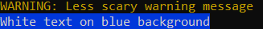
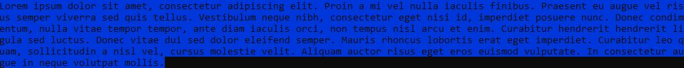

# ccolour
A very simple header that allows you to change colours on ANSI supporting terminals, works on both Windows and Linux.

## Goals
- [x] Create a portable cross-platform console colour changing header
- [x] Compatibility with C and C++
- [ ] Add additional functions for text manipulation (underline, bold, etc...)

## Functions
```c
static void ChangeColour(const char* msg, int fg, int bg, bool revert)
```

### Parameters
***msg***

C-Style string to be outputed in colour, if no string is desired simple pass empty quotations 

***fg***

The ANSI foreground colour code to use, names for the different numbers are defined at the top of *colour.h*

***bg***

Same as *fg* except the background colour to use

***revert***

If set to true the colour of the console will be changed back to default after the coloured text is printed. If instead you wish all future output of that console window to be the specified colour set to false 

NOTE: If set to true the colour of the console will be reverted to it's DEFAULT not to whatever colour it was before *ChangeColour* was called.

## Examples
### Red on black
An error message with red text on a black background:
```c
ChangeColour(
    "ERROR: This is a big scary error\n",
    RED_FOREGROUND, // 31
    DEFAULT_COLOR, // 0
    true
);
```


### C++ Usage
If you want to use C++ STL strings you can use the *c_str* function when passing them to *ChangeColour*:
```cpp
std::string warning = "WARNING: Less scary warning message";
ChangeColour(warning.c_str(), YELLOW_FOREGROUND, DEFAULT_COLOR, true);

// stringstream example
std::stringstream ss;
ss << "White text" << "on" << "blue" << "background";
ChangeColour(ss.str().c_str(), WHITE_FOREGROUND, BLUE_BACKGROUND, true);
```


### Change whole console colour
Example of changing the entire console to a certain colour:

```c
ChangeColour("", BLACK_FOREGROUND, BLUE_BACKGROUND, false);
int c;
FILE* file;
file = fopen("Lorem Ipsum.txt", "r");
if (file)
{
    while ((c = getc(file)) != EOF) putchar(c);
    fclose(file);
}
```


